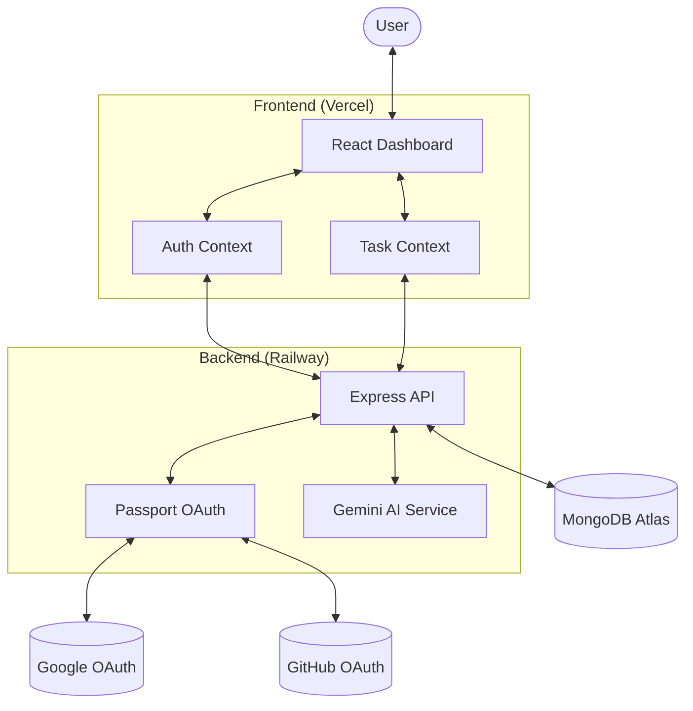

# KaryaAI 🌌

KaryaAI is a premium, AI-integrated task management platform designed to help users organize their workflow with precision and intelligence. By leveraging the power of **Google Gemini AI**, it doesn't just track your tasks—it generates optimized execution strategies to help you get them done effectively.

## 🏗️ System Architecture

KaryaAI is built on the **MERN** stack (MongoDB, Express, React, Node.js) with a decoupled architecture that allows the frontend and backend to scale independently.



## 📂 Project Structure

```text
KaryaAI/
├── backend/          # Node.js & Express API
│   ├── src/
│   │   ├── config/   # Passport, DB, and app config
│   │   ├── features/ # Modular business logic (Auth, Tasks, AI)
│   │   └── utils/    # Shared helper functions
│   └── README.md     # Detailed Backend Docs
├── frontend/         # React SPA (Vite)
│   ├── src/
│   │   ├── api/      # Axios configuration
│   │   ├── context/  # Global state management
│   │   ├── features/ # UI features (Dashboard, Auth, Tasks)
│   │   └── layouts/  # Page wrapper components
│   └── README.md     # Detailed Frontend Docs
└── README.md         # Main Project Documentation
```

## ✨ Core Features

### 1. Intelligent Task Management
- Full CRUD capabilities with priority levels, tags, and status.
- Real-time dashboard with activity contribution graphs.
- High-priority filtering and categorized task views.

### 2. AI Execution Strategist
- Powered by **Google Gemini AI**.
- Analyzes task details (title, description, priority) to generate a step-by-step execution plan.
- Accessible directly from the task details view.

### 3. Secure Social Authentication
- Seamless login via **Google** and **GitHub**.
- Secure session management using **HttpOnly & SameSite Cookies**.
- Local registration and login support with JWT.

### 4. Premium Aesthetic Design
- **Modern UI**: Glassmorphism, dark mode, and vibrant gradients.
- **Micro-animations**: Smooth interactions powered by Framer Motion.
- **Responsive**: Fully optimized for all device sizes.

## 🚀 Quick Start

### 1. Clone & Install
```bash
git clone <your-repo-url>
cd KaryaAI
```

### 2. Setup Backend
```bash
cd backend
npm install
# Create .env based on .env.example
npm start
```

### 3. Setup Frontend
```bash
cd frontend
npm install
# Create .env with VITE_BACKEND_URL
npm run dev
```

## 🌐 Deployment

KaryaAI is designed for modern cloud environments:
- **Backend**: Recommended for **Railway** or **Render**.
- **Frontend**: Recommended for **Vercel** or **Netlify**.
- **Database**: Recommended for **MongoDB Atlas**.


---

Built with ❤️ by [Prashant Kumar](https://github.com/Prashant01pro)
